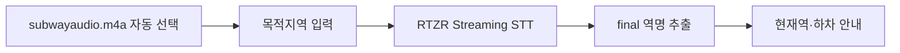

# NextStop STT

[](https://github.com/bumfercar/StationAlert/actions/workflows/ci.yml)

RTZR Streaming STT로 지하철 안내방송에서 현재역을 찾고, 사용자가 지정한 역의 도착을
알려주는 Python CLI 데모입니다.

이 프로젝트는 임의의 음성 파일을 올리는 범용 STT 도구가 아닙니다. 직접 녹음한
`subwayaudio.m4a` 한 파일을 고정 입력으로 사용해 공릉역부터 어린이대공원역까지의
안내방송을 실제 시간 속도로 재현합니다. 사용자는 목적지역만 입력합니다.



## 무엇을 확인하는 데모인가

- 원거리·소음 환경에서 RTZR Streaming STT가 지하철 안내방송을 어떻게 인식하는가
- `CALL`·`MEETING` domain과 keyword score가 역명 인식에 어떤 영향을 주는가
- STT가 만든 final 문장에서 현재역과 광고 속 역명을 구분할 수 있는가
- 사용자가 지정한 목적지역을 인식했을 때 하차 안내까지 연결되는가

이 데모는 안전한 위치 추적 시스템이 아니라, **RTZR STT 설정과 지하철 도메인 규칙을
검증하는 proof of concept**입니다.

## 기술 스택

| 기술 | 역할 |
| --- | --- |
| Python 3.11 | CLI와 도메인 로직 |
| RTZR Streaming WebSocket | 실시간 partial/final 음성인식 |
| Typer + Rich | 대화형 입력과 진행 상태 표시 |
| HTTPX + WebSockets | 인증과 Streaming 연결 |
| Pydantic | decoder 설정과 RTZR 응답 검증 |
| FFmpeg | M4A를 16 kHz mono raw LINEAR16으로 변환 |
| uv | Python과 dependency 설치·실행 |
| Pytest + Ruff + GitHub Actions | offline test와 Windows·macOS·Linux 검증 |

## 처음 실행하기

### 1. 고정 음성 배치

`subwayaudio.m4a`는 승객 음성과 개인정보 보호를 위해 GitHub에 올리지 않습니다. 별도로
전달된 파일을 저장소 루트에 두면 실행 스크립트가 자동으로 선택합니다.

```text
StationAlert/
├── subwayaudio.m4a
├── README.md
└── scripts/
```

실행 중에는 음성 경로를 입력하지 않습니다.

### 2. 운영체제별 도구 설치

macOS(Homebrew):

```bash
brew install git uv ffmpeg
```

Ubuntu·Debian:

```bash
sudo apt-get update
sudo apt-get install --yes git curl ffmpeg
curl -LsSf https://astral.sh/uv/install.sh | sh
```

Windows PowerShell:

```powershell
winget install --id=Git.Git -e
winget install --id=astral-sh.uv -e
winget install --id=Gyan.FFmpeg -e
```

설치 후 새 터미널에서 `git --version`, `uv --version`, `ffmpeg -version`을 확인합니다.
Python 3.11과 프로젝트 dependency는 `uv`가 준비합니다.

### 3. 저장소와 RTZR credential 준비

macOS·Linux:

```bash
git clone https://github.com/bumfercar/StationAlert.git
cd StationAlert
cp .env.example .env
```

Windows PowerShell:

```powershell
git clone https://github.com/bumfercar/StationAlert.git
Set-Location StationAlert
Copy-Item .env.example .env
notepad .env
```

`.env`에 RTZR Developers에서 발급한 값을 입력합니다.

```dotenv
RTZR_CLIENT_ID=your_client_id
RTZR_CLIENT_SECRET=your_client_secret
```

### 4. 데모 실행

| 운영체제 | 명령 |
| --- | --- |
| macOS·Linux | `./scripts/run_demo.sh` |
| Windows PowerShell | `powershell -ExecutionPolicy Bypass -File .\scripts\run_demo.ps1` |

스크립트가 `subwayaudio.m4a`와 `.env`를 자동으로 읽고 dependency를 설치한 뒤 데모를
시작합니다. 사용자는 공릉–어린이대공원 구간 안에서 목적지역만 입력합니다.

```text
NextStop STT
공릉역부터 어린이대공원역까지의 녹음에서 현재 역을 인식합니다.
목적지역을 입력해주세요 (공릉~어린이대공원): 어린이대공원

목적지역: 어린이대공원역
인식 구간: 공릉 → 태릉입구 → 먹골 → 중화 → 상봉 → 면목 → 사가정 → 용마산 → 중곡 → 군자 → 어린이대공원
음성 인식을 시작합니다. 중단하려면 Ctrl+C를 누르세요.
◜ 인식 중 · 역 방송 대기 · 00:03 / 19:39 · Ctrl+C 중단
...
01. 현재 어린이대공원역입니다. | 목적지역에 곧 도착합니다. 이번 역에서 하차하세요.
```

파일 전체를 실제 시간 속도로 보내므로 실행 시간은 약 19분 39초입니다. 목적지역을 먼저
찾으면 안내 후 자동 종료하며, 사용자가 중단하려면 `Ctrl+C`를 누릅니다.

## 적용한 RTZR 설정

| 설정 | 값 | 선택 이유 |
| --- | --- | --- |
| model | `sommers_ko` | 한국어 Streaming keyword 지원 |
| domain | `MEETING` | 객실의 원거리 안내방송 환경에 적합 |
| route keyword | 1.0 | 구간의 모든 역을 같은 조건으로 탐색 |
| destination keyword | 2.0 | 사용자가 반드시 찾아야 하는 목적지역 우선 |
| preprocessing | 100 Hz high-pass | 객실 저주파 진동만 줄이고 발화 경계 변화는 최소화 |
| encoding | raw `LINEAR16`, 16 kHz mono | RTZR Streaming 입력 계약 준수 |
| decision | final only | 변하는 partial로 인한 오탐·중복 방지 |

어린이대공원 주변의 동일한 20초를 비교했을 때 `CALL`은 빈 final을 반환했고,
`MEETING`은 안내방송을 분리했습니다. keyword가 없을 때는
`어린이비복원 세동제 역`, score 1.0과 2.0에서는 `어린이대공원 세종대 역`으로
인식했습니다. score 3.0부터 다른 문장에도 `세종`이 나타나는 편향 징후가 있어 제외했습니다.

현재역은 final 안에 `역명+역`, 알려진 부역명, `이번 역은`, `this station`, 출입문 안내
같은 근거가 있을 때만 확정합니다. 광고 속 역명, 문맥 없는 역명 token, 진행 방향과 반대인
역과 중복 방송은 현재역으로 사용하지 않습니다.

## 핵심 코드 구조

```text
scripts/run_demo.*                 운영체제별 한 번 실행
src/nextstop_stt/audio/            M4A → 실시간 raw LINEAR16 변환
src/nextstop_stt/rtzr/             인증·Streaming WebSocket·응답 검증
src/nextstop_stt/station_extraction.py  안내 문맥 기반 역명 추출
src/nextstop_stt/journey.py        노선 순서·방향·목적지 상태 관리
src/nextstop_stt/cli.py            사용자 입력과 현재역 화면
```

RTZR 연결과 지하철 판단 로직을 분리해, 유료 API를 호출하지 않고도 응답 파싱·역명 추출·
노선 상태를 각각 테스트할 수 있게 했습니다.

## 실행 실패 시 확인

| 증상 | 확인할 내용 |
| --- | --- |
| `uv를 설치해주세요` | `uv --version` 확인 후 터미널 다시 실행 |
| `FFmpeg를 설치해주세요` | `ffmpeg -version`, `ffprobe -version`과 PATH 확인 |
| credential 오류 | `.env` 파일명과 `RTZR_CLIENT_ID`, `RTZR_CLIENT_SECRET` 값 확인 |
| 음성 파일을 찾지 못함 | `StationAlert` 루트에 파일명이 정확히 `subwayaudio.m4a`인지 확인 |
| 실행이 오래 걸림 | 오류가 아니라 원본을 실시간 속도로 보내는 동작이며 전체 약 19분 39초 소요 |
| 화면에 역이 추가되지 않음 | 연결 오류가 아니라 RTZR final에서 역명 근거를 만들지 못한 구간일 수 있음 |
| 사용량 초과·429 | RTZR Developers의 남은 사용량과 동시 channel 제한 확인 |
| 중간에 종료하고 싶음 | `Ctrl+C`; 지금까지 받은 근거는 `results/private/`에 저장 |

원인을 확인해야 할 때만 `./scripts/run_demo.sh --show-text`를 사용해 RTZR final 전사를
표시합니다. 전사에는 주변 승객 음성이 포함될 수 있으므로 기본 화면에서는 숨깁니다.

## 검증과 한계

```bash
uv sync --frozen --extra dev
uv run pytest
uv run ruff check .
```

기본 test는 유료 RTZR API를 호출하지 않습니다. GitHub Actions는 Ubuntu, macOS,
Windows에서 Python 3.11, FFmpeg, CLI와 도메인 로직을 검증합니다.

- 어린이대공원 구간에서는 목적지 인식과 하차 안내를 확인했습니다.
- 공릉·중화 등 RTZR가 역명 token을 만들지 못한 구간도 있습니다.
- domain과 score 비교는 한 구간의 결과이므로 전체 노선 최적값으로 일반화하지 않습니다.
- 음성만 사용하므로 방송 사이의 실제 위치는 알 수 없습니다.
- `.env`, 원본 음성, 전사, raw RTZR 결과와 비공개 보고서는 Git에 포함하지 않습니다.

## 참고한 공식 문서

- [RTZR 인증](https://developers.rtzr.ai/docs/authentications/)
- [RTZR Streaming STT](https://developers.rtzr.ai/docs/stt-streaming/)
- [RTZR Streaming WebSocket](https://developers.rtzr.ai/docs/stt-streaming/websocket/)
